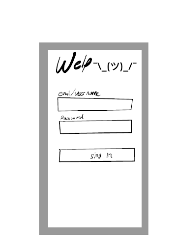
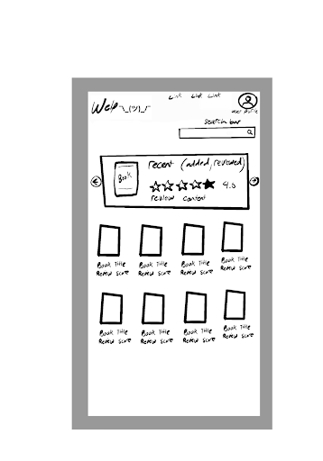
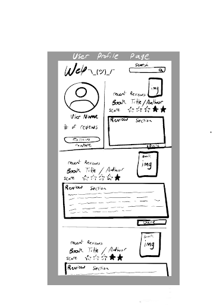
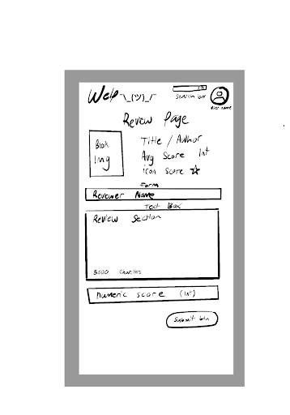
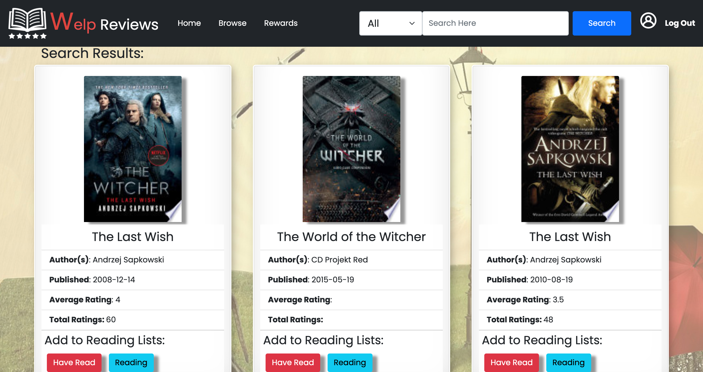
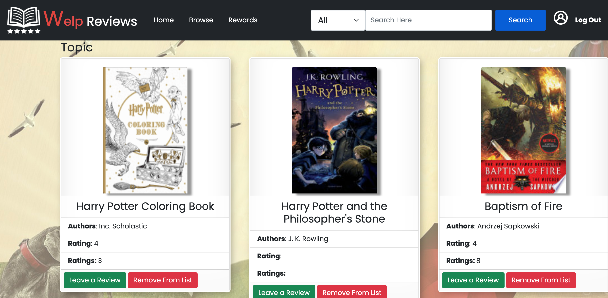
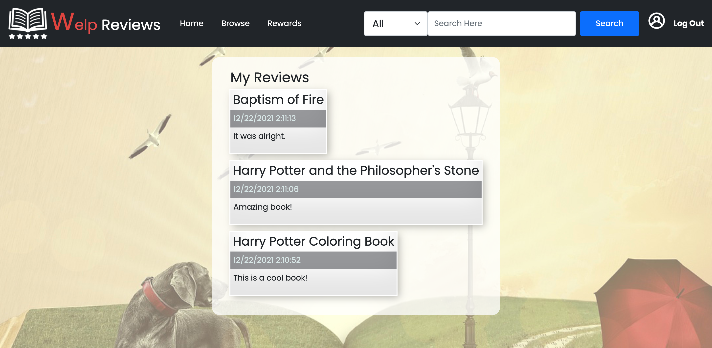

# Welp Reviews 

## Description

Welp Reviews is a book reviews and personal digital library management application. Welp Reviews allows users to browse the books based on the title, author and subject. Once a user is logged in, he can leave reviews to the books, which is sorted based on the created date. Users can also add books to their reading lists, including Have Read, Reading, and Will Read.

## User Story

AS a book reader,
I WANT to be able to search books based on title, author and subject,
SO that I can build my personal digital library.

AS a book reader,
I WANT to be able to view the ratings of different books,
SO that I can decide if I would like to read them in the future.

AS a book reader,
I WANT to be able to view and leave reviews to the books,
SO that users can use them as references.

AS a book reader,
I WANT to be able to add books to the reading lists,
SO that users can keep track of their reading status.

## Table of Contents

- [Installation](#installation)
- [Usage](#usage)
- [Wire Frames](#wire-frames)
- [Images of the Current Website](#images-of-the-current-website)
- [Technologies](#technologies)
- [Work Division](#work-division)
- [License](#license)
- [Contributing](#contributing)
- [Deployment](#deployment)
- [Questions](#questions)

## Installation

`npm install`

## Usage

`node server`

## Wire Frames

## Images of the current website

Search Result Page

Collection Page

Review Page

Profile Page

Login Page

## 

## Technologies

HTML, Bootstrap, jQuery, Javascript, Express, MySQL, sequelize, Axios (backend API client), Google Books API, Handlebars

## Work Division

Aaron and Andrew: site design, UI, templates, styling, deployment.  
Jared: data models and seed data.  
Tina: Google Books API, search functions

## License

This software is licensed under the [MIT](https://opensource.org/licenses/MIT) license.

## Contributing

Create an issue and pull request as needed

## Deployment

https://enigmatic-beyond-88465.herokuapp.com

## Questions

Check out my [GitHub profile](https://github.com/yanghuixi1)!
If you have any questions or concerns, feel free to email me at <yanghui.xi1@gmail.com>
